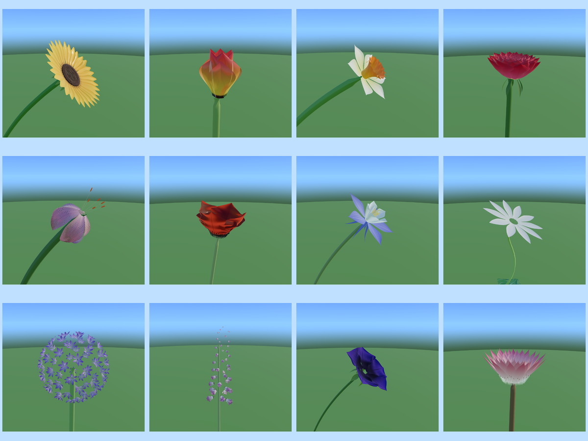

# 🌸 Flowers — a parameterized morphospace

**Live: [flowers.exe.xyz](https://flowers.exe.xyz)**



A real-time, procedurally generated flower — in a breeze, under a blue sky, with a
lens flare. Not a model of *a* flower but of the **space** of flowers, which is by
some distance the most extravagant morphospace in this series. Third in a set, after
the [fish rig](https://marine.exe.xyz) and [fruit](https://fruit.exe.xyz).

```sh
npm install
npm start          # http://localhost:5175
npm run smoke      # headless geometry checks — every preset, every morph, every extreme
npm run gallery    # render a plate per species into examples/ (needs npm start)
npm run build      # bundle to dist/
```

## The plan

A flower is **concentric whorls on a receptacle** — sepals, petals, stamens, carpels,
outside in — and almost every flower on earth is that plan with different counts,
different fusions, and different degrees of exaggeration. The parameter tree follows
the botany exactly, and the atom is the **petal**: one warped sheet with enough knobs
to be a daisy's ray, a tulip's cup, a Turk's-cap lily's back-flipped tepal, an
orchid's lip or a leaf.

| knob | what it does |
|---|---|
| **curl** | the spine's arc. Negative cups it into a bowl (tulip, poppy); positive sweeps it back — a Turk's-cap lily reflexes ~180° until its tips nearly touch the stem. This one number carries most of the corolla taxonomy. |
| **width** | a fraction of the petal's own length, so it reads as the inverse of the botanical L:W ratio. A daisy ray is 5:1; a rose petal is nearly square; an oriental poppy's is genuinely **wider than long**, which everyone gets wrong. |
| **tip** | pointed / rounded / notched / fringed. An oxeye daisy's ray really does end in two or three little teeth, and you don't miss them until they're gone. |
| **cup · fold · twist · ruffle** | the gutter, the midrib crease, the roll, and the margin waviness that separates "alive" from "CG". |
| **spur** | the nectar spur. See below. |

## Three things worth knowing

**Doubling is a homeotic conversion, not a petal count.** A double rose is not a rose
with extra petals bolted on — it is a rose whose **stamens turned into petals**. So the
`doubling` slider moves organs from the stamen budget into the petal budget and
conserves the total. Turn it up and the flower fills in and its centre *disappears*,
because the centre is what the new petals are made of. Five petals and a boss of a
hundred stamens at one end; a hundred-petal English rose with no centre at all at the
other. Botany already designed the best knob in this project.

**Petals glow because they are thin.** A poppy petal is **three cell layers thick** and
among the most densely pigmented tissue ever measured, which is exactly why a backlit
one looks like stained glass. So translucency is driven by a **thickness gradient** —
thick and dark where the petal attaches, tissue-thin at the margin — and the veins are
fed into that gradient too, so they block the backlight and read as dark ribs across a
glowing petal, which is what you actually see.

**The spur is the funniest thing in botany.** *Aquilegia* spans **~0 mm to 16 cm** of
nectar spur *within a single genus*, chased by bees, then hummingbirds, then hawkmoths;
Darwin's orchid runs to 43 cm. The slider goes to 8× the petal length and the spurs
curl as they grow, because a metre-long straight spike is much less funny than a
metre-long hook.

## Phyllotaxis, a third time

The golden angle keeps turning up, and it means something different each time:

- **The sunflower disc.** 700–3000 florets at 137.508°, which produces the 34/55/89
  Fibonacci parastichies you can count on a real head. They open from the **rim
  inward**, so a sunflower wears a moving annulus of gold pollen with dark unopened
  buds inside it — the `bloom` slider is that wave.
- **Petal packing.** A rose, a lotus and a camellia pack their petals on the *same*
  spiral, which is exactly why a hundred-petal rose reads as a rose rather than a
  stack of pentagons. `layout: spiral` vs `whorl` is that choice.
- **Leaves up the stem**, and **florets in an umbel** — an allium is a Fibonacci sphere
  of ninety little star-flowers.

## Optics

Three real surface classes, each a slider:

- **translucency (poppy)** — thin, dense, scattering: lit from within.
- **velvet (pansy)** — conical epidermal cells that focus light *into* the pigment and
  leave no specular to lift the black. A pansy's blotch is about the blackest surface
  in botany.
- **gloss (buttercup)** — a ~3 µm thin film over an actual **air layer** above a starch
  reflector. A genuine mirror; it is why a buttercup lights up your chin.
- **iridescence** — real (tulip and *Hibiscus trionum* have cuticle diffraction
  gratings), but it only reads over a dark background, so it's gated to the dark eye,
  which is exactly where *H. trionum* puts it.

Plus the pattern channels that make a flower a *particular* flower: the dark basal eye,
the spotted throat (a foxglove's spots are each ringed in white — that ring is most of
why they read as spots), veins, and the pale nectar-guide well of a morning glory.

## Wind, sky, flare

The wind lives entirely in the vertex shader — a bouquet can be hundreds of blooms and
re-posing that on the CPU would kill the framerate. It bends each vertex as a
cantilever (deflection ~ height²: the stem base barely moves, the bloom describes a big
lazy arc), in three layers — a slow sway, a slower gust envelope so it isn't a
metronome, and a fast flutter on the petals only. Each plant gets its own phase, so a
meadow doesn't sway in lockstep.

The sky is a gradient dome with a sun; the lens flare is a screen-space pass whose
ghosts march through the frame centre (as a real lens's internal reflections do) and
which **vanishes when a bloom passes in front of the sun**, because a flare that hangs
in mid-air behind a flower instantly breaks the spell.

## Bunches

`single`, `raceme` (a foxglove's spire — flowers open **bottom-up**, so one stem shows
capsules below, open bells in the middle and tight buds at the tip), `umbel` (an
allium's globe), `cyme`, and `bouquet` — which is not botany at all, but the whole point
of flowers is that people put them in a vase.

## Sharing

Every flower is a URL, encoding the preset plus only the leaves you changed:

```
flowers.exe.xyz/#flower=rose~corolla.double=1
flowers.exe.xyz/#flower=sunflower:poppy:0.4
```

## Honest approximations

- A **snapdragon**'s real corolla is a hinged two-lipped mouth a bee has to lever open;
  we fake the look, not the mechanism.
- A **morning glory**'s petals are genuinely *fused* into a funnel; we approximate with
  five broad overlapping petals and the five darker seams.
- The **Turk's-cap lily** and the **passionflower** are the weakest presets in the set —
  see [ROADMAP.md](ROADMAP.md).
